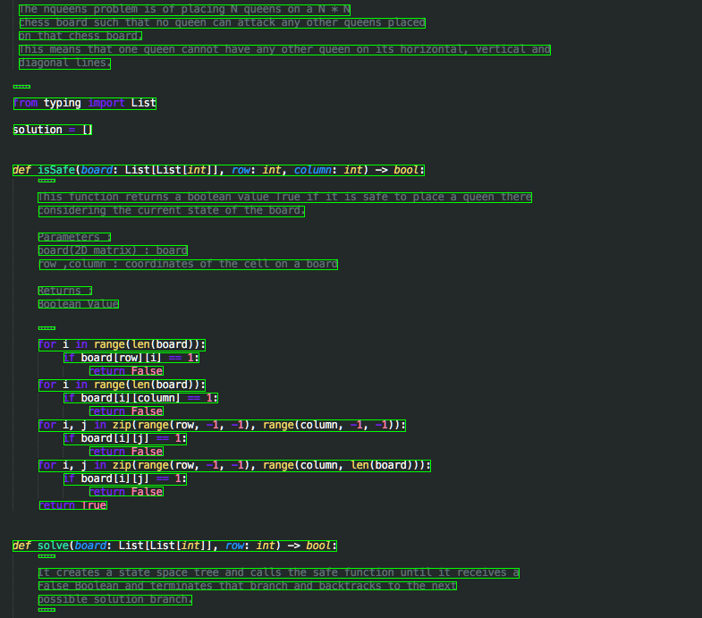

# OCR for Source Code Detection

## Steps

1. Text Detection

Text detection is done using OpenCV. Binary thresholding and findcontours gives the rough areas of text. Then merging contours in the same horizontal location gives the location of text.

2. Text Recognition

PyTorch GRU + CTC loss is used. Collected 100s of screenshots of source codes in python & Java for training. 

